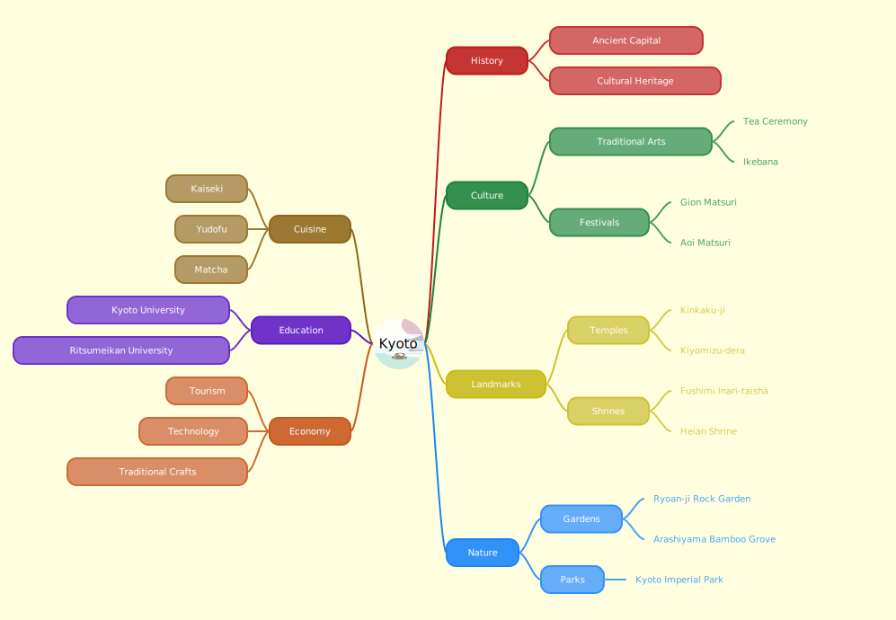

# Text to Mindmap API

A serverless function that generates SVG mindmaps from indented text data.

## Overview

This API converts hierarchical text data into visual mindmap diagrams in SVG format. The root node is placed in the center, with child nodes branching out to the left and right sides.

Since it does not rely on external SVG rendering libraries, it can be easily used as a serverless function.

## API Endpoint

### POST /api/mindmap

Generates a mindmap SVG from the provided text data.

#### Request Body

Can be sent as a JSON body or as form data with `application/x-www-form-urlencoded`.


| Field | Type | Description |
|-------|------|-------------|
| code | string | Indented text representing the mindmap hierarchy |
| type | string | Response type ('image' for SVG, default for JSON) |
| broadChar | boolean | Enable broad character width calculation (for CJK characters) |
| base64image | string | Optional base64 encoded image for root node |

A sample of base64image is in `test/base64image.txt`.

**Note about `code`:**
- Write each item on one line.
- Use the number of leading spaces to indicate the depth of the tree structure.
- The highest level (root node) should have one leading space.
- The root node must be the first line of the text.

Samples of code are in `test/code*.txt`.


#### Example Request Body

```json
{
  "code": " Kyoto\n  History\n   Ancient Capital\n   Cultural Heritage\n  Culture\n   Traditional Arts\n    Tea Ceremony\n    Ikebana\n   Festivals\n    Gion Matsuri\n    Aoi Matsuri\n  Landmarks\n    Temples\n     Kinkaku-ji\n     Kiyomizu-dera\n    Shrines\n     Fushimi Inari-taisha\n     Heian Shrine\n  Nature\n   Gardens\n     Ryoan-ji\n     Arashiyama Bamboo Grove\n   Parks\n     Kyoto Imperial Park\n  Cuisine\n   Kaiseki\n   Yudofu\n   Matcha\n  Education\n   Kyoto University\n   Ritsumeikan University\n  Economy\n   Tourism\n   Technologies\n   Traditional Crafts",  
  "type": "image"
}
```

### Example SVG Output

Use `test/code1.txt` as `code` and `test/base64image.txt` as `base64image`.



# Source Code

This is a Next.js app.

- `app/api/mindmap/route.tsx` is the API endpoint.
- `lib/TreeNode.ts` is the class for the tree node.

# Test

You can test the API by GET function in `app/api/mindmap/route.tsx`.
Please uncomment the GET function code in the file.

Run `npm run dev` to start the server.
Open `http://localhost:3000/api/mindmap` with query parameters in your browser.

# Deployment

You can easily deploy this API as a serverless function to Vercel.

1. Clone this repository.
2. Run `npm install`.
3. Install Vercel CLI.
4. Run `vercel login`.
5. Run `vercel`.
